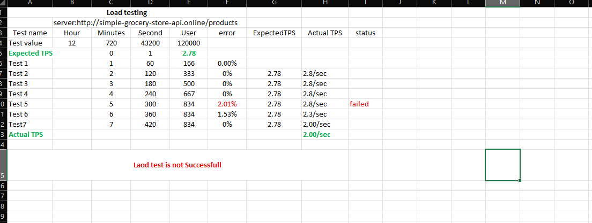

# Random User Generator API

## Introduction

The Random User Generator API is a simple and powerful API that allows developers to generate random user data for use in their applications. This API can return user data in various formats, including JSON, XML, CSV, and YAML, making it flexible and easy to integrate with different systems. Whether you need to populate a database with test users, create mock data for your applications, or simply explore random user profiles, this API is a perfect tool for the job.

This README will guide you through the process of using the Random User Generator API with jQuery to fetch random user data and handle the results.

## Table of Contents

- [Overview](#overview)
- [Tests Conducted](#tests-conducted)
  - [Load Test](#load-test)
  - [Stress Test](#stress-test)
  - [Capacity Analysis](#capacity-analysis)
- [Results](#results)
  - [Excel Reports](#excel-reports)
  - [Screenshots](#screenshots)

## Overview

The Simple Grocery Store API provides product data via the endpoint `http://simple-grocery-store-api.online/products`. Performance testing was conducted to ensure the API can handle various levels of traffic and to identify its maximum capacity.

## Tests Conducted

### Load Test

Load testing was conducted to determine how the API performs under expected user loads. The test aimed to identify response times, throughput, and potential bottlenecks.

### Stress Test

Stress testing was performed to determine the API's behavior under extreme conditions. This test helps identify the point at which the API fails or experiences significant performance degradation.

### Capacity Analysis

Capacity analysis was conducted to establish the maximum number of requests the API can handle before its performance becomes unacceptable or it fails.

## Results

### Excel Reports

- [Load Test Report](https://docs.google.com/spreadsheets/d/1A-Aceno4KY2Ughyuj_ARp0g-dO9st-I8/edit?gid=1082269937#gid=1082269937)
- [Stress Test Report](https://docs.google.com/spreadsheets/d/1A-Aceno4KY2Ughyuj_ARp0g-dO9st-I8/edit?gid=910062733#gid=910062733)

### Screenshots

# Load Testing Picture

# Stress Testing Picture

